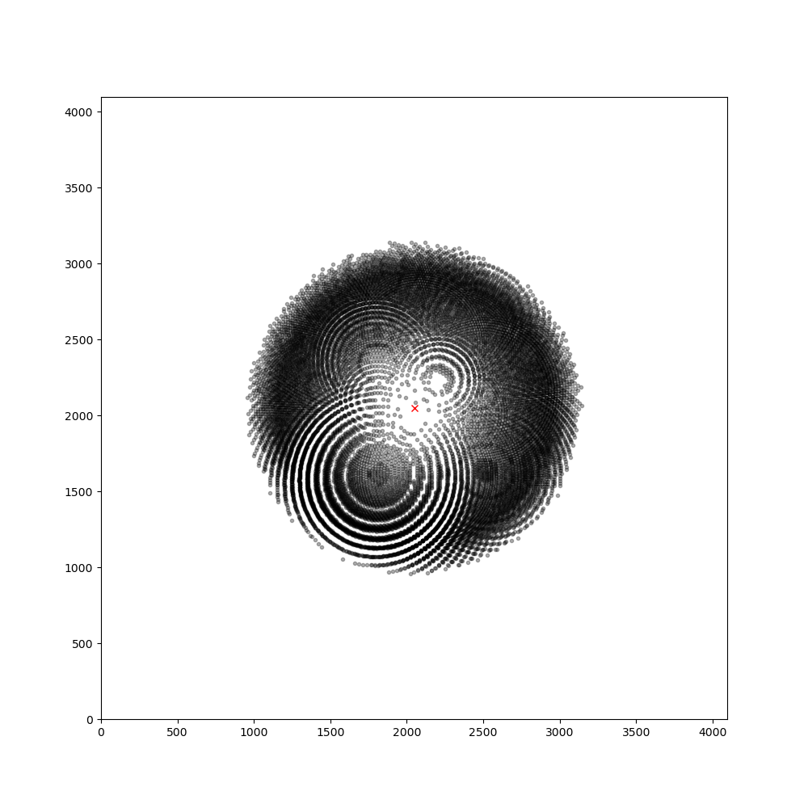

# disco
Generate feasible Laue Bragg spots from randomly oriented crystals


### Installation

```bash
git clone https://github.com/Hekstra-Lab/disco
cd disco
python setup.py install
disco.wow
```



