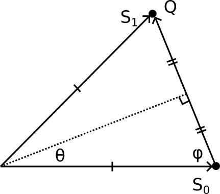

### Calculating wavelength of Predicted Laue Reflections
The goal is to calculate the wavelength associated with a predicted reflection. 
In this setting, we can assume we have access to 
 - The direction of the incoming beam, $\hat {S}_0$. Which is a unit vector. 
 - The theoretical scattering vector, $Q=RB$, calculated from a rotation matrix, $R$ and reciprocal bases, $B$. 

Some useful relationships:
 - $\lVert S_0 \rVert = 1 / \lambda$
 - $\hat{S}_0 = \frac{S_0}{\lVert S_0 \rVert}$
 - $S_0 = \hat{S}_0 / \lambda$
 - $\lVert Q \rVert = 1 / d_h $

The diffraction geometry looks like this for a particular reflection:

where the origin of reciprocal space is on the right. Notice that the beam $S_0$ moves from left to right in this coordinate system. 

Starting from the dot product,

$$
\begin{align}
Q\cdot -S_0 &= \lVert Q\rVert \lVert S_0 \rVert \cos \phi  \\
Q\cdot -\hat{S}_0 \frac{1}{\lambda} &= \frac{\lVert Q\rVert}{\lambda}  \cos \phi   \\
Q\cdot -\hat{S}_0  &= \lVert Q \rVert \cos \phi 
\end{align}
$$

From the right triangle on the bottom half of the scattering diagram, it is clear that 

$$
\begin{align}
\cos \phi &= \left(\frac{\lVert Q \rVert}{2} \right) \div  \lVert S_0 \rVert \\
&= \left(\frac{\lambda}{2}\right) \lVert Q \rVert 
\end{align}
$$

Combining the equations,

$$
\begin{align}
Q\cdot -\hat{S}_0 &= \lVert Q\rVert^2 \frac{\lambda}{2} \\
Q\cdot -\hat{S}_0 &= Q\cdot Q \frac{\lambda}{2}
\end{align}
$$

finally,

$\lambda = \frac{-2 Q\cdot \hat{S}_0}{Q\cdot Q}$
